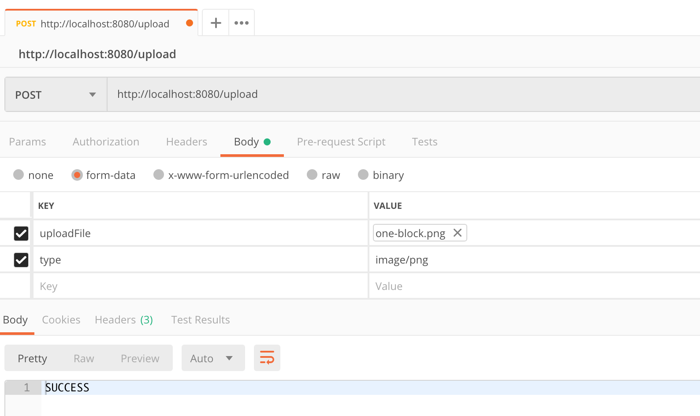

# images
Go project to process images


build & run container
```
docker build --tag images-image .
docker run --name images -p 8080:8080 -d images-image
```

Try it out
<p  align="center">
    
</p>


clean up
```
docker stop images
docker rm images
docker rmi images-image
```