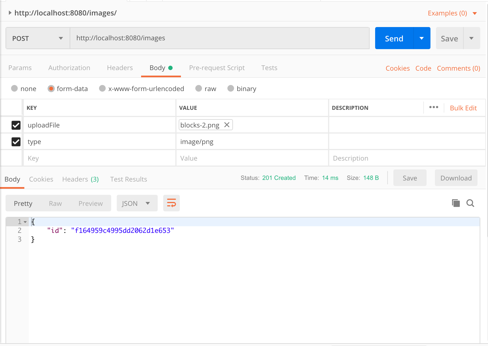

# image2diagram
Hobby project to convert images into block diagrams that can be used by https://github.com/jimareed/block-diagram-editor .  Still under development, it currently will only find the first block in an image and doesn't support connectors.


Start with an image which contains blocks
<p  align="center">
    
</p>

Use postman to add the image: `post /images`
<p  align="center">
    
</p>

Convert it to a block diagram structure (for use by block-diagram-editor) by getting the diagram: `get /images/{id}/diagram`
<p  align="center">
    
</p>

build & run container
```
docker build --tag image2diagram-image .
docker run --name image2diagram -p 8080:8080 -d image2diagram-image
```


clean up
```
docker stop image2diagram
docker rm image2diagram
docker rmi image2diagram-image
```