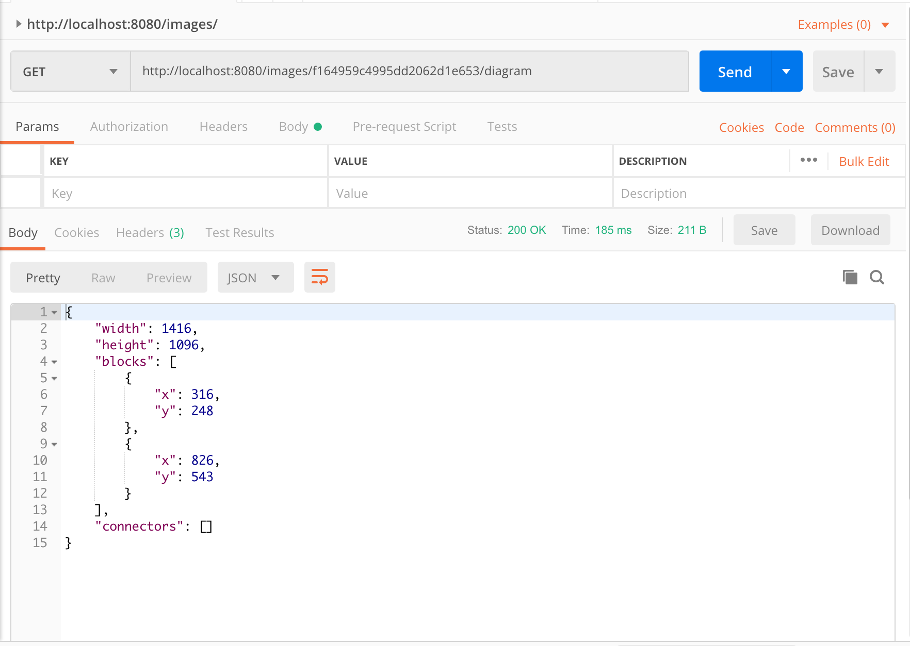

# images
Hobby project to convert images into block diagrams that can be used by https://github.com/jimareed/block-diagram-editor .  Still under development, it currently will only find the first block in an image and doesn't support connectors.


build & run container
```
docker build --tag images-image .
docker run --name images -p 8080:8080 -d images-image
```

Add an image
<p  align="center">
    
</p>

Convert it to a block diagram structure (for use by block-diagram-editor)
<p  align="center">
    
</p>


clean up
```
docker stop images
docker rm images
docker rmi images-image
```